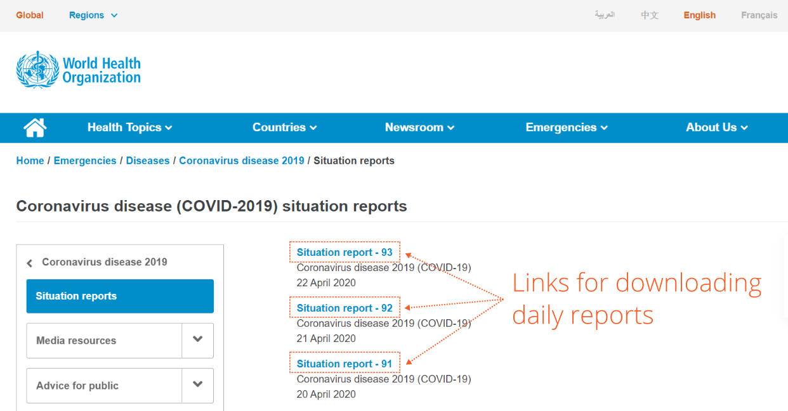
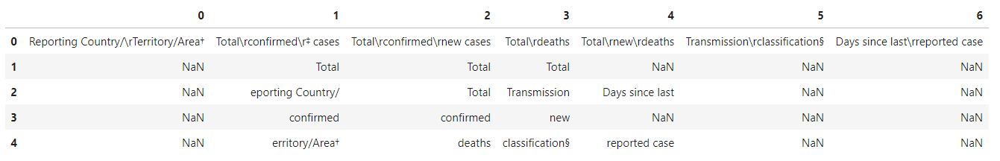
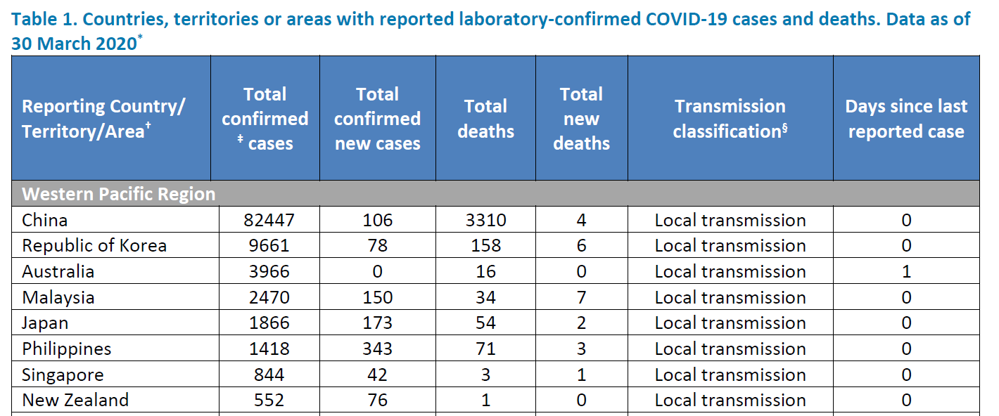
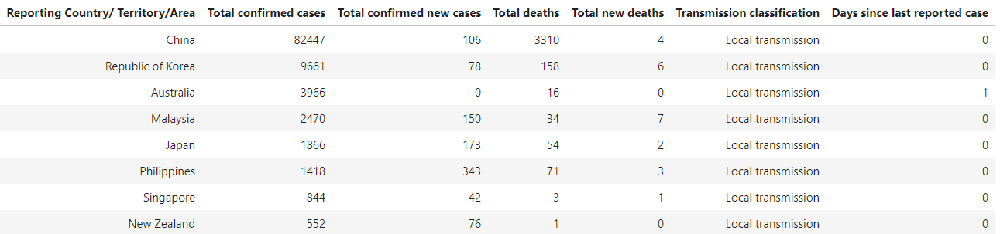

# Wrangling COVID-19 data

At the time of writing, we're living in this extraordinary situation where many of us, all around the world, are stuck inside our homes because of COVID-19. 
And as many people do, I've been closely following the enormous growth in number of infections. 
It was in one of my searches for the latest numbers where I came across [these reports published by the WHO](https://www.who.int/emergencies/diseases/novel-coronavirus-2019/situation-reports/), and I thought by myself, these could serve as a good example for practicing a few useful data wrangling techniques. 
I decided to break them up into 3 sections:
1. Web scraping
2. Read data from PDFs
3. Clean data using pandas

## Web scraping
_The python scripts for this section are stored in the src folder._

Web scraping is useful for automating actions on websites. 
For example, we can use it for extracting data displayed on a web page, or we could use it to automate clicking on links to download data, which is what I'll be doing.

In this project, I have included 2 methods:
1. using [Requests](https://requests.readthedocs.io/en/master/) and [Beautiful Soup](https://www.crummy.com/software/BeautifulSoup/bs4/doc/), which is an excellent combination capable of handling most web scraping tasks.
2. using [Selenium](https://selenium-python.readthedocs.io/index.html), which is useful when you're dealing with dynamic websites, built using frameworks like React, Angular, or Vue.

I would only recommend using Selenium when the Requests and Beautiful Soup combo doesn't work, because working with Selenium is finicky, as it is with most UI automation tools.

_These are the links we'll be clicking on the WHO website_

## Read PDF
_The code for this section is in a jupyter notebook in the notebooks folder._

Extracting data from PDFs is always a challenge. 
It's because PDFs are designed for humans to read and not for machines. 
It lacks a standard for how the information is stored underneath, which leads to inconsistent results when we try to extract data from PDFs.

What you get is generally a big mess, with data/text elements not lining up properly, and sometimes scattered all over the place.
You often need to do a great deal of post-processing to get it into an acceptable shape for analysis.
Depending on the use case you have, it might not even be doable. 
Luckily, these reports from the WHO are reasonably clean, but they have enough problems so I can show you several useful wrangling techniques.

Each PDF contains a table with key statistics for every country that has confirmed cases. 
I'm going to extract all of this data using [tabula-py](https://tabula-py.readthedocs.io/en/latest/), which is a wrapper around the java library tabula and conveniently outputs in pandas DataFrames for further processing.

## Clean data
_The code for this section is in the same jupyter notebook as in the previous section._

The table in the PDF spans multiple pages, which tabula-py returns as multiple DataFrames. 
Upon closer inspection, we also see a number of formatting issues we have to deal with. 
I'm going to use [pandas](https://pandas.pydata.org/) to clean the data and turn the output into just one, neatly formatted table.

_Formatting issues in the table header (raw output from tabula-py)_

## What is the end result
_Original table in the PDF report_

_End result after cleaning data using pandas (screenshot from jupyter notebook)_

## Contact
I'm sure there is a lot I can improve in my code. 
Do you have any suggestions? 
Let me know!
I'm always looking to advance my skills.

Got any questions? 
Do you find this useful?
Or do you have some data problem that you need help with?

[Reach out to me here](https://twitter.com/rtm010) and I'm more than happy to answer any of your questions or to just have a chat :smiley: 
We could all use some social interaction during these difficult times :relaxed:
